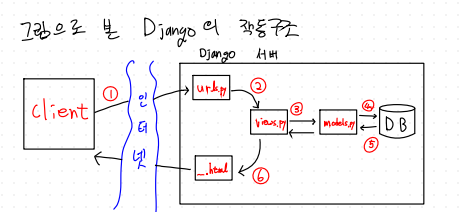

# modbusProjectWithDjango
Django를 활용한 modbusTCP 실습

## Django의 작동 구조

1. 클라이언트가 url을 입력해 인터넷을 통해 Django 서버에 접속한다.
2. url request에 의해 urls.py가 url에 해당하는 view로 분배한다.
3. 클라이언트의 요구사항에 맞춰 view가 동작한다.
4. 해당사항이 데이터베이스 모델로 표현된다.
5. 실제 DB내부에서 처리가 발생한다.
6. 클라이언트의 요청에 맞춘 .html이 렌더링되어 인터넷 브라우저를 통해 전달 된다.

## ModbusClient 연결 설정
```python
modbus_client=ModbusClient('192.168.0.60',502)
modbus_client.parity = Parity.even #짝수 패리티
modbus_client.unitidentifier = 1 # slave id 
modbus_client.baudrate = 9600  #전송속도 보오 레이트
modbus_client.stopbits = Stopbits.one #정지 비트  데이터 송출 종료 알림

modbus_client.connect()

Digital.objects.all().delete()
Analog.objects.all().delete()

coils = modbus_client.read_coils(0, 10)
for i in range(len(coils)):
    Digital.objects.create(id=i,coil_value=coils[i])

holding_registers=modbus_client.read_holdingregisters(0,10)
for i in range (len(holding_registers)):
    Analog.objects.create(id=i,register_value=holding_registers[i])


```
웹 페이지 작동시 해당 IP,Port번호로 설정 후 connect한 후, 초기 coils 값과 holding_registers 값을 읽어 각각 Digital과 Analog 모델 값으로 DB에 추가 한다.
## views.py
### index 합수
```python

def index(request):
    
    coils = modbus_client.read_coils(0, 10)
    indexCoils = dict(enumerate(coils))

    holding_registers=modbus_client.read_holdingregisters(0,10)
    indexRegisters =dict(enumerate(holding_registers))
    
    discrete_inputs = modbus_client.read_discreteinputs(0, 10)	
    input_registers = modbus_client.read_inputregisters(0, 10)  

    context={'coils': indexCoils ,'registers': indexRegisters,'discrete_inputs': discrete_inputs,'input_register': input_registers }
    return render(request,'modbus/list.html',context)
```
초기페이지에서  coil, holdingregister, discrete_inputs, input_registers 값을 읽어 modbus/list.html로 전달한다.

### writeCoil 함수
``` python

def writeCoil(request,index):
    
    coils[index] = not coils[index]
    modbus_client.write_single_coil(index, coils[index])
    
    if coils[index] == False:
        item =Digital.objects.get(id=index)
        item.coil_value = False
        item.save()
    else:
        item= Digital.objects.get(id=index)
        item.coil_value = True
        item.save()
        
    print(Digital.objects.values_list('id','coil_value'))
    
    context={'changedcoil': coils}
    return render(request, 'modbus/coils.html',context)
```
현재의 coil 값에 not을 붙여 write_single_coil을 통해 변경한 후, Digital Model 의 해당 index 값을 coils[index]값으로 변경한다.


### writeRegister 함수
```  python

def writeRegister(request, register_index, register_value):
    
    if request.method == 'POST':
        register_value=request.POST.get('number')    
        modbus_client.write_single_register(register_index,  int(register_value))
        
        item= Analog.objects.get(id=register_index)
        item.register_value = int(register_value)
        item.save()
    else:
        print("method is get")
    
    print(Analog.objects.values_list('id','register_value'))
    
    context= {'register_index': register_index, 'register_value': register_value }
    
    return render(request,'modbus/register.html', context)

```
list.html에서 전달받은 방식이 POST면, number에 해당하는 값을 register_value에 저장하고 write_single_register를 통해 변경한다.  
Analog Model의 해당 index 값을 register_value로 변경한다.
## urls.py 

```python 

urlpatterns = [
    path('',views.index , name='index'),    
    path('coil/<int:index>/',views.writeCoil,name='writeCoil'),
    path('register/<int:register_index>/<int:register_value>', views.writeRegister, name='writeRegister'),
    path('digitalapi/', DigitalRestAPI.as_view()),
    path('digitalapi/<int:id>',DigitalRestAPI.as_view()) ,
    path('analogapi/',AnalogRestAPI.as_view()),
    path('analogapi/<int:id>',AnalogRestAPI.as_view()),
]

```
url.py의 path에서 해당하는 view.py의 매칭되는 함수로 이동한다.


## models.py

```python

class Digital (models.Model):
    coil_value =models.BooleanField(default=False)
    
    def __str__(self):
        return str(self.coil_value)
    
    
class Analog (models.Model):
    register_value =models.IntegerField(default=0)

    def __str__(self):
        return str(self.register_value)
    
```
boolean 값의 coil_value를 갖는 Digital 클래스와 integer 값의 register_value를 갖는 Analog 클래스가 존재한다. 

## Django REST framework
django rest framework를 이용해 rest API를 통해 데이터베이스 CRUD(Create, Read, Update, Delete)를 구현한다.

### get 함수 (READ)
```python

    def get(self, request, **coil_id):
        if (coil_id.get('id') is None):
            queryset= Digital.objects.all()
            serializer = DigitalSerializer(queryset,many = True)
            return Response(serializer.data,status=status.HTTP_200_OK)
        else:
            digital_id=coil_id.get('id')
            serializer=DigitalSerializer(Digital.objects.get(id=digital_id))
            return Response(serializer.data, status=status.HTTP_200_OK)

```
coil_id를 인자로 받지 않으면 전체 queryset을 response하고, 인자로 받으면 특정 coil_id값의 query만 json형태로 표시한다.

### post 함수 (CREATE)
```python
    
    def post(self, request):
        serializer = DigitalSerializer(data=request.data)
        if serializer.is_valid():
            serializer.save()
            return Response(serializer.data,status=status.HTTP_201_CREATED)
        else:
            return Response(serializer.errors, status=status.HTTP_400_BAD_REQUEST)
    
```
request.data를 인자로 받아 id를 할당해 queryset에 추가한다

### put 함수 (UPDATE)
```python

    def put(self, request, **coil_id):
        if coil_id.get('id') is None:
            return Response("move to detail coil_id page ", status=status.HTTP_400_BAD_REQUEST)
        else:
            digital_id = coil_id.get('id')
            digital_object = Digital.objects.get(id=digital_id)
            changed_serializer = DigitalSerializer(digital_object, data=request.data)
            modbus_client.write_single_coil(digital_id,request.data.get('coil_value'))
            if changed_serializer.is_valid():
                changed_serializer.save()
                return Response(changed_serializer.data, status=status.HTTP_200_OK)
            else:
                return Response("changed_serializer not exist. ", status=status.HTTP_400_BAD_REQUEST)

```
id를 인자로 받지 않으면 id를 입력하는 페이지로 이동하라는 메세지를 띄운후 400 bad request를 보낸다.  
id가 인자로 주어지는 url로 접속시 , 해당 id값의 value를 수정해 modbus_client에 write한다. 

### delete 함수  (DELETE)
```python

    def delete(self, request, **coil_id):
        if coil_id.get('id') is None:
            return Response("move to detail coil_id page ", status=status.HTTP_400_BAD_REQUEST)
        else:
            digital_id = coil_id.get('id')
            digital_object = Digital.objects.get(id=digital_id)
            digital_object.delete()
            return Response("delete ok", status=status.HTTP_200_OK)

```
id가 인자로 주어지지 않으면 지우고자 하는 id page로 이동하라는 메세지를 띄운 후 400 bad request를 보낸다.  
id가 인자로 주어지는 url로 접속시, id에 해당하는 값을 queryset 에서 삭제한다.
